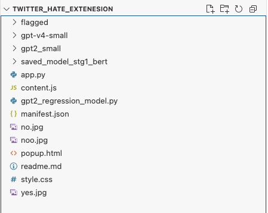

#### Steps to run the chrome extension

##### Make sure before running:

1) Model weights are inside this folder 
    - gpt-v4-small folder (Implicit)
    - gpt2_small folder (Rasch)
    - saved_model_stg1_bert

##### To run:

1) Run the program in terminal/command line : python app.py 
    - leave it running 
2) Remove __py_cache__ folder after run 
3) Upload the whole twitter_hate_extension folder onto chrome extension 
    - [Link](chrome://extensions/)
    - make sure you turned on developer mode 
    - then press on "load unpacked on the upper left"
4) log into twitter and it should be there 

##### NOTE:
- not perfect but still a nice viz of the models. 
- you can rerun it on the same input to find better explanations.